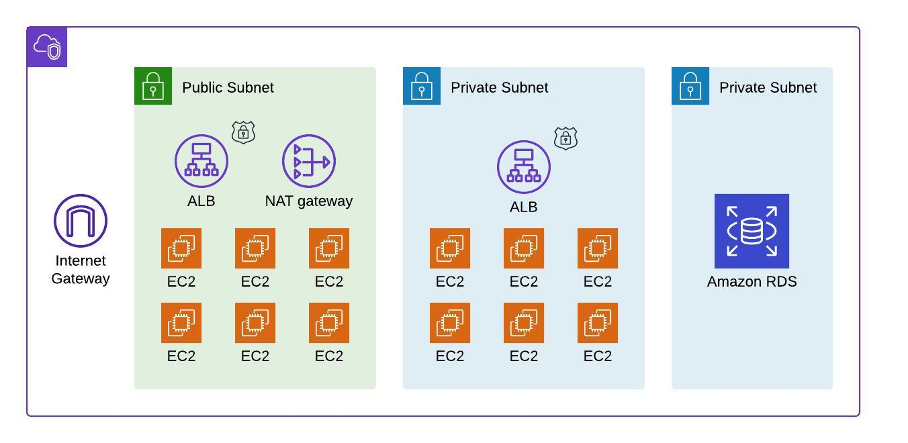

## Secure Auth Project ##

## About the project ##

This project implements secure authentication and session management in Node.js using session cookies and JWT.

The project includes mitigations which address common OWASP security vulnerabilities including:
- input validation/sanitization
- secure credentials requirements
- secure passwords using salting and hashing
- cookie security
- use of secure HTTP headers such as x-xsrf-token, content-security-policy, etc.
- use of high-entropy IDs and prevent insecure direct object reference

## System architecture ##

